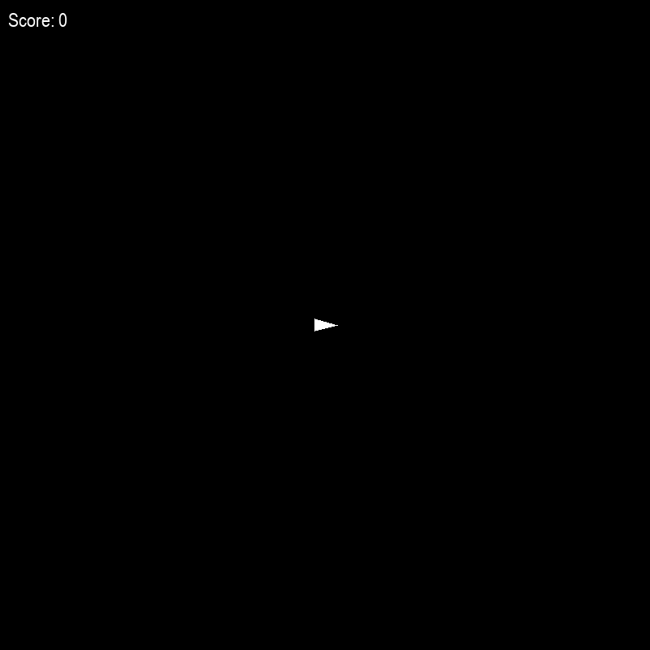

# Deep Q-Learning Project: Asteroid Clone Agent

Welcome to the GitHub repository of my Asteroids Game Clone project, where I explore the fascinating world of reinforcement learning (RL) by training a Deep Q-Network (DQN) agent to navigate and survive in a custom-built environment simulating the classic Asteroids arcade game. This project is crafted with Python, leveraging the Pygame library for game development and TensorFlow for implementing the DQN agent.

## Project Overview
The project simulates the Asteroids game, challenging the player's spacecraft to avoid and destroy asteroids. The game environment, constructed using Pygame, features dynamic asteroid generation, player movement (forward thrust and rotation), shooting mechanics, and collision detection.

The heart of the project is the DQN agent, developed with TensorFlow. This agent learns to make decisions (move forward, rotate, shoot) based on the current game state, aiming to maximize its survival time and score by avoiding asteroids and shooting them down.

## Game Environment 
The Game class encapsulates the game environment. It initializes the game window, handles game logic (e.g., spawning asteroids, updating game objects, detecting collisions), and renders the game state to the screen. This class provides a realistic and challenging setting for training the DQN agent, with features including:

* Dynamic asteroid spawning and movement
* Player spaceship control (acceleration and rotation)
* Bullet shooting with cooldown mechanics
* Collision detection between the spaceship, asteroids, and bullets
* Score tracking based on asteroid destruction

## DQN Agent
The DQNAgent class represents the reinforcement learning agent. It uses a neural network to approximate the Q-function, mapping state-action pairs to expected rewards. The agent learns an optimal policy over time through exploration (selecting random actions) and exploitation (choosing actions based on learned Q-values), balancing these strategies using an epsilon-greedy approach. Key aspects include:

* A neural network architecture with dense layers enhanced by L2 regularization to improve generalization
* An experience replay system that enables efficient learning from previous actions by storing and reusing past experiences.
* A target network that provides a stable foundation for Q-value predictions, mitigating fluctuations during learning.
* An epsilon decay approach that gradually transitions the agent from exploration to more focused exploitation as it gains experience.

## Training and Evaluation
Training involves running the game environment across multiple episodes. During each episode, the agent interacts with the environment, makes decisions based on its current state, and learns from the results. The cumulative reward and score from each episode offer insights into the agent's performance and learning advancements. Key steps in the training loop include:

* Resetting the environment at the beginning of each episode to ensure a fresh start.
* Using the DQN agent to select actions according to the current state of the game.
* Updating the game state and receiving rewards based on the agent's actions
* Periodically saving the model and explicitly saving upon reaching high scores to capture improved policies.

Evaluation follows the training phase to assess the effectiveness of the learned policies without further training. This is achieved by running the agent through several episodes while keeping the exploration rate (epsilon) at a minimal level, ensuring that the agent predominantly uses learned behaviors. The focus during evaluation is to measure the agent’s performance in terms of consistency, decision-making quality, and ability to handle different scenarios in the game environment. These evaluations help identify areas where the model excels and where it may need further training or adjustments.

## Future Enhancements
This project lays the groundwork for further exploration and experimentation in reinforcement learning. Potential improvements include:

* Experimenting with different neural network architectures and hyperparameters
* Implementing advanced RL algorithms (e.g., Double DQN, Dueling DQN)
* Expanding the agent state to include more detailed information of the environment

Contributions, suggestions, and discussions on extending and improving the project are welcome.

## Acknowledgments
This project is inspired by the classic Atari Asteroids game and the wealth of research in the field of reinforcement learning. I am grateful to the open-source community for providing the tools and libraries that made this project possible.

Happy learning and exploring!
